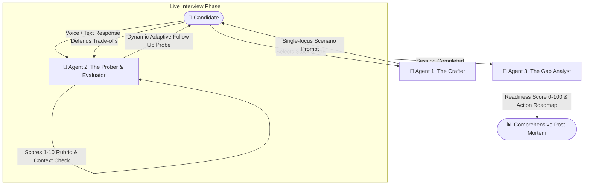

# ⚡ CRACK IT // Autonomous Multi-Agent Tech Interviewer

<div align="center">

```
  ██████╗██████╗  █████╗  ██████╗██╗  ██╗    ██╗████████╗
 ██╔════╝██╔══██╗██╔══██╗██╔════╝██║ ██╔╝    ██║╚══██╔══╝
 ██║     ██████╔╝███████║██║     █████═╝     ██║   ██║   
 ██║     ██╔══██╗██╔══██║██║     ██╔═██╗     ██║   ██║   
 ╚██████╗██║  ██║██║  ██║╚██████╗██║ ╚██╗    ██║   ██║   
  ╚═════╝╚═╝  ╚═╝╚═╝  ╚═╝ ╚═════╝╚═╝  ╚═╝    ╚═╝   ╚═╝   
```

**Stop reciting textbook definitions. Start defending real production architectures.**

[](https://nextjs.org/)
[](https://www.typescriptlang.org/)
[](https://ai.google.dev/)
[](https://tailwindcss.com/)
[](https://developer.mozilla.org/en-US/docs/Web/Progressive_web_apps)
[](LICENSE)

</div>

---

## 📌 What is Crack It?

Most mock interview platforms fail engineers because they either:
1. Fire academic, 5-part textbook trivia questions nobody asks in real engineering loops, or
2. Force you to solve algorithmic LeetCode puzzles that have zero bearing on actual system reliability, latency triage, or concurrency bugs.

**Crack It** is an autonomous, conversational technical interview simulator designed to replicate the psychological and technical pressure of an L5/L6 senior staff interview. Powered by a specialized **Tri-Agent architecture**, it calibrates to your exact Years of Experience (YoE) and tech stack, posing **single-focus, production-incident scenarios** before dynamically grilling you on your trade-offs with intelligent follow-up probes.

---

## 🧠 The Tri-Agent Architecture

Crack It does not rely on a monolithic prompt. It orchestrates three specialized AI agents via Google's latest `@google/genai` runtime:



1. **Agent 1 // The Question Crafter**:
   - Synthesizes realistic, scenario-grounded engineering problems based on your calibrated YoE (1–15 yrs) and stack.
   - *No robotic multi-clause exam prompts.* Example: *"Your payment worker pool starts timing out under a 10x flash sale spike. What's your immediate triage strategy?"*
2. **Agent 2 // The Evaluator & Prober**:
   - Evaluates technical depth, correctness, and architectural soundess using a strict 1–10 rubric.
   - Emulates a human interviewer by generating a razor-sharp, 1-turn follow-up probe drilling into the edge cases of your answer (*"You mentioned caching the inventory count in Redis—how do you guarantee zero overselling when two workers write concurrently?"*).
3. **Agent 3 // The Gap Analyst & Career Coach**:
   - Runs a holistic post-mortem across your entire session.
   - Computes an objective 0–100 Readiness Score, categorizes strengths vs. fatal weaknesses, and delivers a prioritized tactical study roadmap.

---

## ⚡ Key Features

### 🎙️ Full-Duplex Voice Interface
- **Mic Dictation (STT)**: Real-time, hands-free speech-to-text powered by the native Web Speech Recognition API with pulsating voice activity feedback.
- **Interviewer Read-Aloud (TTS)**: Listen to questions spoken aloud in natural cadences via SpeechSynthesis, simulating real remote video calls.

### ⏱️ High-Stakes Timer & Incident Pressure
- **60-Second Countdown**: Replicates the snap decision-making demanded in production outages and real technical rounds.
- **+60s Extension**: Need to think through race conditions? Tap `+60s` for an adrenaline reprieve.
- **Socratic Hint Engine**: Stuck? Tap `Hint` for conceptual breadcrumbs that guide your thinking without spoiling the answer.
- **Tactical Skip**: Gracefully pass on questions you haven't seen in production; the interviewer adapts conversationally.

### 📶 Dual-Engine Operation (AI vs. Offline)
- **Live AI Mode**: Powered by ultra-low-latency Gemini 2.5 Flash with structured JSON schemas.
- **Offline / Practice Mode**: Complete zero-cloud, zero-latency local question bank with built-in evaluation matrices. Perfect for planes, subways, or interviewing without an internet connection.

### 🛡️ BYOK (Bring Your Own Key) & Role-Based Quotas
- **Free Tier**: Includes 1 full AI mock session per day out of the box (zero credit card or signup required).
- **BYOK (Bring Your Own Key)**: Integrated 3-step modal guide to plug in your own free Google AI Studio key (`AIzaSy...`). Stored strictly in your browser's `localStorage`—never routed through external servers. Unlocks **unlimited mock interviews forever**.

### 📱 Installable PWA
- First-class Progressive Web App (PWA) with client-side service worker caching.
- Add to Home Screen on iOS / Android or install as a native desktop window on macOS / Linux / Windows.

### 🎨 Cyberpunk Neomorphic UI
- 7-stage Framer Motion introductory animation featuring smooth `layoutId` brand choreography.
- Seamless Dark & Light theme transitions tailored for late-night grind sessions.

---

## 🛠️ Supported Technology Matrix

| Domain | Calibrated Specializations |
|---|---|
| **Frontend Engineering** | React 19, Next.js (App Router), TypeScript, Vue 3, Core Web Vitals, SSR/SSG/ISR |
| **Backend & Systems** | Node.js / Express, Go (Golang), Python / FastAPI, Java / Spring Boot |
| **Infrastructure & Architecture** | Distributed Systems, System Design, Microservices, Kubernetes, AWS, High-Throughput Databases |

---

## 🚀 Quickstart Guide

### Prerequisites
- Node.js 18.18+ or Node.js 20+
- npm / pnpm / yarn

### 1. Clone & Install
```bash
git clone https://github.com/Just-a-developer-abhi/crack-it.git
cd crack-it
npm install
```

### 2. Configure Environment (Optional for BYOK / Offline)
Create a `.env.local` file in the root directory:
```bash
# Optional: System-wide fallback key (users can also bring their own via the UI)
GEMINI_API_KEY=AIzaSy...your_gemini_api_key_here
```
> 💡 *Note: You do not need an API key to run or test the app! You can toggle **Offline Mode** on the onboarding screen or input your key directly into the UI via the **"Set Up AI Key"** button.*

### 3. Launch Development Server
```bash
npm run dev
```
Open [http://localhost:3000](http://localhost:3000) in your browser.

### 4. Production Build
```bash
npm run build
npm run start
```

---

## 🏗️ Project Structure

```
crack-it/
├── app/
│   ├── api/
│   │   └── interview/
│   │       └── route.ts         # Edge-ready API route for Tri-Agent orchestration
│   ├── globals.css              # Custom Tailwind utilities & dark-mode styling
│   ├── layout.tsx               # Root layout with PWA manifest & ThemeProvider
│   ├── manifest.ts              # Native Web App Manifest
│   └── page.tsx                 # Main application state machine & flow controller
├── components/
│   ├── ApiKeyModal.tsx          # 3-step interactive BYOK setup guide
│   ├── BottomResponseBar.tsx    # Response input with mic dictation & audio visualizer
│   ├── FeedbackDashboard.tsx    # Post-mortem analysis, readiness ring & print/export
│   ├── Header.tsx               # Brand logo, rate-limit badge & settings
│   ├── InterviewScreen.tsx      # Active interview view (timer, hints, TTS, probes)
│   ├── IntroAnimation.tsx       # 7-stage Framer Motion intro sequence
│   ├── OnboardingForm.tsx       # Stack picker, YoE slider & AI/Offline mode selector
│   └── ThemeToggle.tsx          # Dark/Light mode switcher
├── lib/
│   ├── gemini.ts                # Google GenAI SDK multi-agent prompts & schemas
│   ├── mock-data.ts             # Curated offline question bank & fallback heuristics
│   ├── rate-limit.ts            # Client-side role-based daily quota manager
│   ├── speech.ts                # Web Speech API (STT dictation & TTS reader)
│   └── types.ts                 # Strict TypeScript schemas for all entities
└── public/
    ├── icon.svg                 # Vector PWA application icon
    └── sw.js                    # Offline caching service worker
```

---

## 🔒 Security & Privacy

- **Zero Data Mining**: Your practice answers and evaluation scores remain in your browser memory and are never stored in a remote database.
- **Client-Side Key Storage**: When you Bring Your Own Key (BYOK), it is saved in your local browser storage and only used for your direct API calls.
- **Sandboxed Secrets**: `.env*.local` is enforced in `.gitignore` to prevent leakage to source control.

---

## 📄 License

Distributed under the MIT License. See `LICENSE` for more information.

---

<div align="center">
  <b>Built for engineers who build things that matter.</b><br/>
  <sub>Crafted with 🔥 by Abhishek Singh Rajawat</sub>
</div>
